# 2. Automated EBS Snapshot Creation and Cleanup

**Objective:** Automate EBS volume backups and delete snapshots older than a retention period.

## Architecture

```
EventBridge (weekly) --> Lambda (Python 3.12, Boto3) --> EC2 API
                                                            ├── CreateSnapshot + CreateTags
                                                            ├── DescribeSnapshots (filter by tag)
                                                            └── DeleteSnapshot (older than retention)
```

## Steps to Achieve

### 1. EBS Setup

1. Either use an existing EBS volume attached to an EC2 instance, or create a small standalone volume:
   - **EC2 console → Volumes → Create volume** (e.g. `gp3`, 1 GiB, same AZ as any instance you have — a standalone unattached volume works fine for this exercise).
2. Note the **Volume ID** (`vol-xxxxxxxxxxxxxxxxx`) — you'll pass this to Lambda as an environment variable.

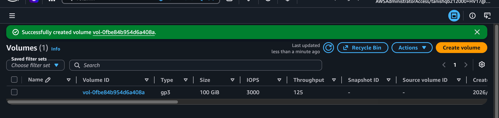
_Volume `vol-0fbe84b954d6a408a` successfully created._

### 2. Lambda IAM Role

Create a role (`ebs-snapshot-lambda-role`) with `AWSLambdaBasicExecutionRole` attached, plus this inline policy:

```json
{
  "Version": "2012-10-17",
  "Statement": [
    {
      "Sid": "CreateAndTagSnapshots",
      "Effect": "Allow",
      "Action": ["ec2:CreateSnapshot", "ec2:CreateTags"],
      "Resource": "*"
    },
    {
      "Sid": "DescribeAndDeleteSnapshots",
      "Effect": "Allow",
      "Action": ["ec2:DescribeSnapshots", "ec2:DeleteSnapshot"],
      "Resource": "*"
    },
    {
      "Sid": "BasicLambdaLogging",
      "Effect": "Allow",
      "Action": [
        "logs:CreateLogGroup",
        "logs:CreateLogStream",
        "logs:PutLogEvents"
      ],
      "Resource": "arn:aws:logs:*:*:*"
    }
  ]
}
```

> Note: `ec2:CreateSnapshot`, `ec2:DescribeSnapshots`, and `ec2:DeleteSnapshot` don't support resource-level restriction to a single volume/snapshot ARN in all partitions, so scoping is done via tags/conditions and by filtering in code (`OwnerIds=["self"]` + the `CreatedBy=Lambda-Backup` tag) rather than the IAM `Resource` field alone.

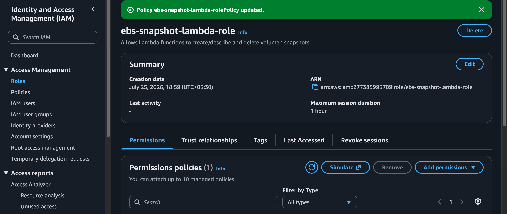
_`ebs-snapshot-lambda-role` created with the inline policy attached._

### 3. Lambda Function

1. Create a Lambda function: runtime **Python 3.12**, attach the role above.
2. Environment variables:
   - `VOLUME_ID` = your EBS volume ID
   - `RETENTION_DAYS` = `30` (**default**)
3. Paste the code from [`lambda/ebs_snapshot_lifecycle.py`](lambda/ebs_snapshot_lifecycle.py). It:
   1. Calls `create_snapshot(VolumeId=..., Description=...)`.
   2. Tags the new snapshot with `CreatedBy=Lambda-Backup` and `CreatedOn=<ISO date>` via `create_tags`.
   3. Calls `describe_snapshots(OwnerIds=["self"], Filters=[{"Name": "tag:CreatedBy", "Values": ["Lambda-Backup"]}])`, using the **paginator** to handle accounts with many snapshots.
   4. Deletes any snapshot in that filtered set whose `StartTime` is older than `RETENTION_DAYS`.
   5. Prints the ID of the snapshot created and the IDs of any snapshots deleted.
4. Set **Timeout** to ~30 seconds (snapshot creation call itself returns quickly; it's the copy that happens async in the background).

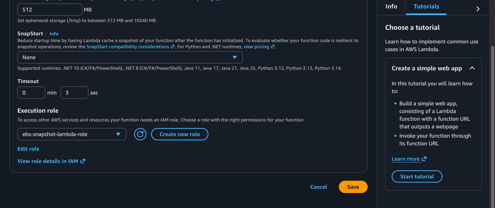
_Lambda function `EBS_SNAPSHOT_Lifecycle` configured with `ebs-snapshot-lambda-role` as its execution role._

### 4. Manual Testing

1. Manually invoke the Lambda with an empty test event `{}`.
2. In the **EC2 console → Snapshots**, confirm a new snapshot appears tagged `CreatedBy=Lambda-Backup`.

   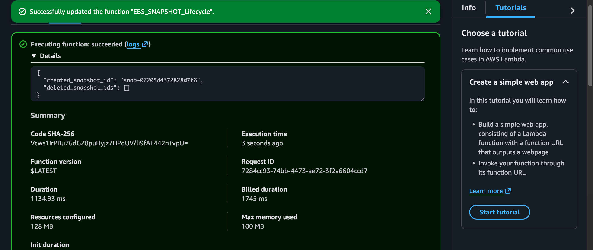
   _First invocation: a snapshot (`snap-02205d4372828d7f6`) is created; `deleted_snapshot_ids` is empty since nothing is past retention yet._

3. To test cleanup without waiting 30 days: temporarily lower `RETENTION_DAYS` to `0`, re-run, and confirm the snapshot(s) created in the previous test get deleted. Reset `RETENTION_DAYS` to `30` afterward.

   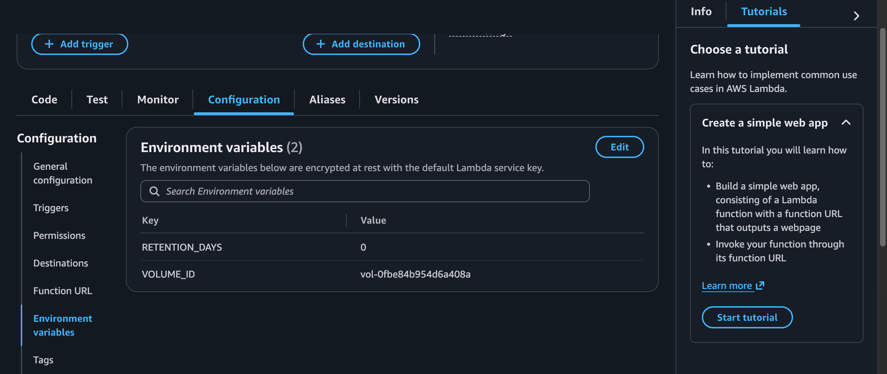
   _Environment variables updated: `RETENTION_DAYS=0`, `VOLUME_ID=vol-0fbe84b954d6a408a`, to force immediate cleanup on the next run._

   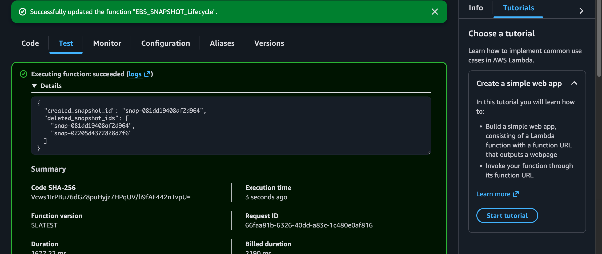
   _Second invocation: a new snapshot (`snap-081dd19408af2d964`) is created, and both it and the earlier snapshot (`snap-02205d4372828d7f6`) are deleted since `RETENTION_DAYS=0` makes everything eligible for cleanup._

4. Check CloudWatch Logs for the printed created/deleted snapshot IDs.

   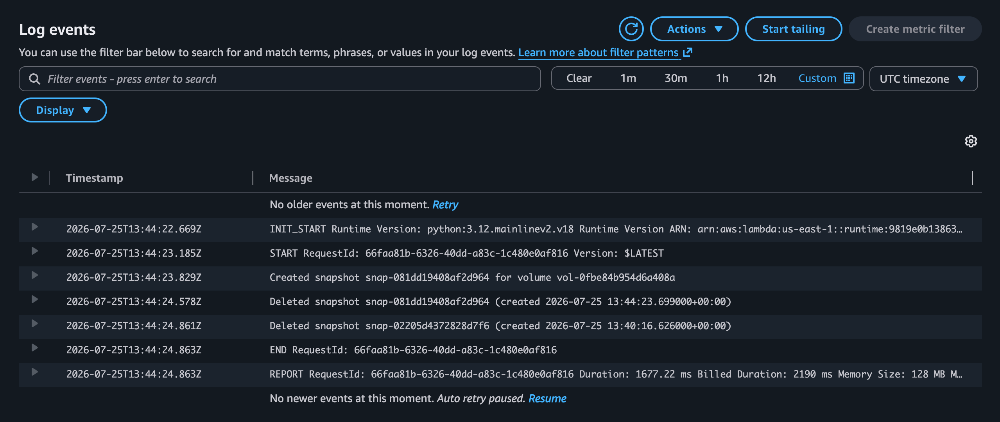
   _CloudWatch Logs showing the snapshot created for `vol-0fbe84b954d6a408a`, followed by both snapshots being deleted with their original creation timestamps._

### 5. EventBridge Schedule (Weekly)

1. **EventBridge → Schedules → Create schedule**.
2. Schedule name: **EBS_SNAPSHOT_Lifecycle_Scheduler**.
3. Choose **Cron-based schedule** and define the recurrence — e.g. `cron(10 * ? * SAT *)` to run weekly on Saturdays. For a true "once a week" production schedule, swap this for a single fixed time/day, e.g. `cron(0 3 ? * MON *)` for every Monday at 03:00 UTC.

   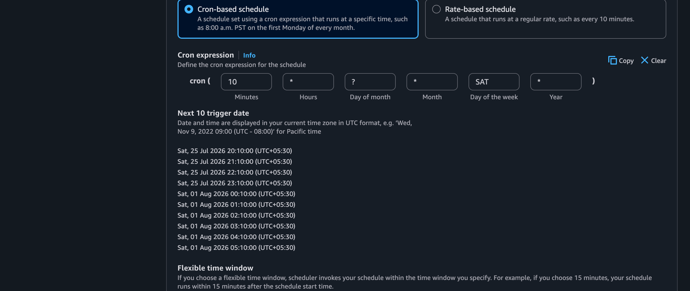
   _Cron-based schedule configured as `cron(10 * ? * SAT *)`, with the next 10 trigger dates shown for verification before saving._

4. Under **Schedule pattern → Occurrence**, choose **One-off schedule** (with a specific date/time) if you just want to fire it once for a controlled test, or **Recurring schedule** for the real weekly automation.

   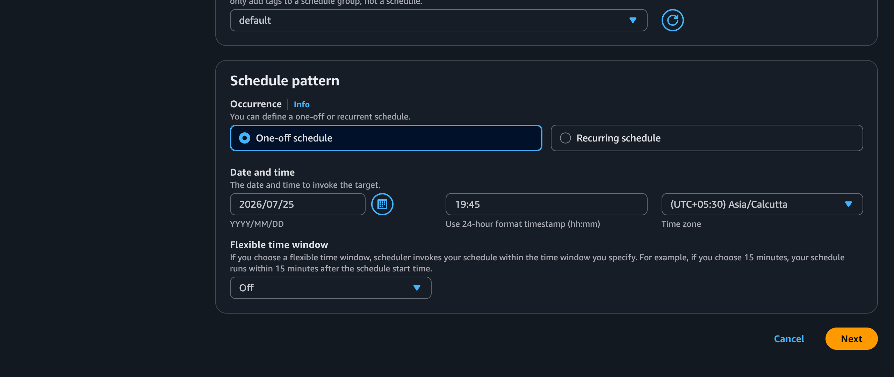
   _One-off schedule selected here for a single controlled test run at `2026/07/25 19:45 (UTC+05:30)` before switching to recurring for production use._

5. Set the **Target** to this Lambda function, and review the **execution role** EventBridge Scheduler will assume to invoke it.

   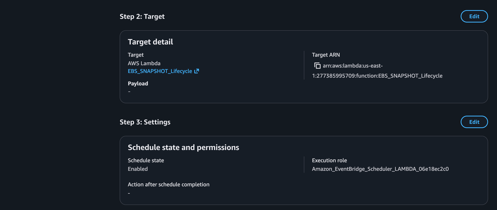
   _Target confirmed as `EBS_SNAPSHOT_Lifecycle`, with schedule state **Enabled** and execution role `Amazon_EventBridge_Scheduler_LAMBDA_06e18ec2c0`._

6. Save the schedule.

### 6. Testing the EventBridge Schedule

1. Let the schedule fire (or wait for your one-off test time), then check **CloudWatch → Log groups → this function's log group → Log streams**.
2. Confirm multiple log streams exist, each corresponding to a separate scheduled invocation — this proves EventBridge (not just manual testing) is triggering the Lambda.

   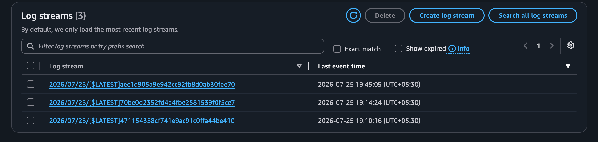
   _Three separate log streams, each from a distinct invocation triggered by the EventBridge schedule rather than a manual test click._

3. Open any of these log streams and confirm the same created/deleted snapshot IDs pattern seen during manual testing (Step 4) — this confirms the scheduled runs behave identically to manual ones.

## Discussion Point: Lambda vs. AWS Data Lifecycle Manager (DLM)

**AWS Data Lifecycle Manager (DLM)** does scheduled EBS snapshot creation and age-based retention natively, with no code required. Lambda is still the better choice when you need **custom retention logic** DLM can't express (e.g. "keep the last N snapshots regardless of age" or different retention per environment tag), **cross-account/cross-region snapshot copies** as part of a DR strategy, or **notifications/integrations** (SNS/Slack alert on failure, writing an audit record to DynamoDB) tied to the backup event itself.
