# 3. Auto-Tagging EC2 Instances on Launch

**Objective:** Automatically tag newly launched EC2 instances for resource tracking, ownership, and cost allocation.

## Architecture

```
EC2 instance state change (running) --> EventBridge rule --> Lambda (Python 3.12, Boto3) --> ec2:CreateTags
                                                                       |
                                                          (bonus) CloudTrail lookup --> launching IAM user --> Owner tag
```

## Steps to Achieve

### 1. Lambda IAM Role

Create a role (`ec2-auto-tag-lambda-role`) with `AWSLambdaBasicExecutionRole` attached, plus this inline policy (see [`inline-policy.json`](./inline-policy.json) for the full document used):

```json
{
  "Version": "2012-10-17",
  "Statement": [
    {
      "Sid": "TagAndDescribeInstances",
      "Effect": "Allow",
      "Action": ["ec2:CreateTags", "ec2:DescribeInstances"],
      "Resource": "*"
    }
  ]
}
```

(`ec2:CreateTags` doesn't support tagging conditions scoped to "only instances," so `Resource: *` is standard here; you can further restrict with a `Condition` on `ec2:ResourceTag` if you want to limit it to instances tagged for a particular project.)

For the **bonus** (CloudTrail lookup), add:

```json
{
  "Sid": "ReadCloudTrail",
  "Effect": "Allow",
  "Action": "cloudtrail:LookupEvents",
  "Resource": "*"
}
```

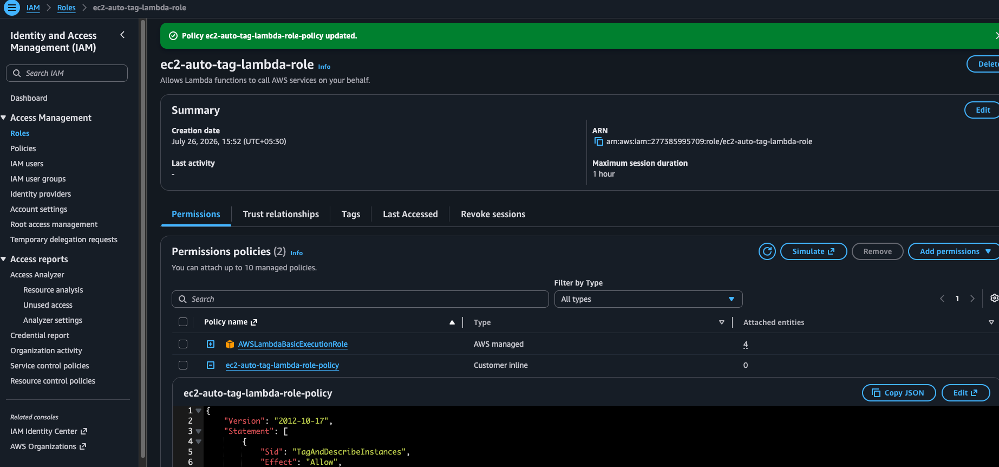
_`ec2-auto-tag-lambda-role` created with `AWSLambdaBasicExecutionRole` (AWS managed) plus `ec2-auto-tag-lambda-role-policy` (customer inline) attached._

### 2. Lambda Function

1. Create a Lambda function: runtime **Python 3.12**, attach the role above.
2. Environment variables (optional):
   - `ENVIRONMENT_TAG_VALUE` = e.g. `dev`
3. Paste the code from [`lambda/ec2_auto_tag.py`](lambda/ec2_auto_tag.py). It:
   1. Reads `event["detail"]["instance-id"]` from the EventBridge event.
   2. Calls `ec2.create_tags(Resources=[instance_id], Tags=[...])` immediately with `LaunchDate=<current date>`, `Environment=<ENVIRONMENT_TAG_VALUE>`, and `Name=<NAME_TAG_PREFIX>-<instance_id>`.
   3. **(Bonus)** Separately, if `ENABLE_OWNER_LOOKUP=true`, uses `cloudtrail.lookup_events` filtered by `EventName=RunInstances`, parses the response to find the launching IAM identity, and adds an `Owner=<iam-user>` tag via a second `create_tags` call once resolved.
   4. Prints a confirmation message with the instance ID and tags applied at each stage.

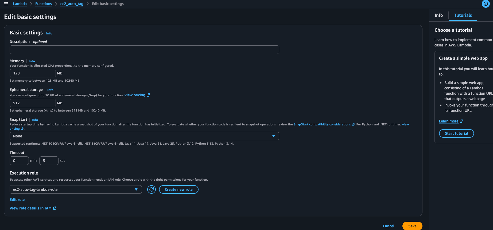
_Lambda function `ec2_auto_tag` configured with `ec2-auto-tag-lambda-role` as its execution role._

### 3. EventBridge Rule

1. **EventBridge → Rules → Create rule**.
2. Rule type: **Event pattern**.
3. Event pattern (matches the assignment spec):

```json
{
  "source": ["aws.ec2"],
  "detail-type": ["EC2 Instance State-change Notification"],
  "detail": {
    "state": ["running"]
  }
}
```

4. Target: this Lambda function.
5. Save.

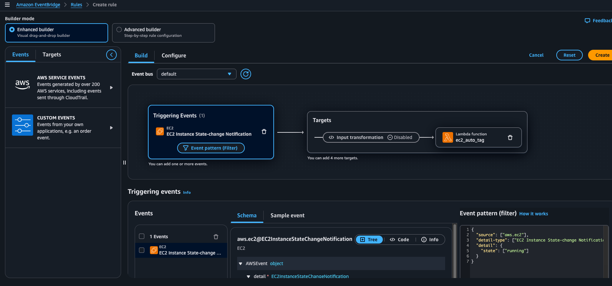
_Rule builder showing the `EC2 Instance State-change Notification` triggering event, the `state: running` filter, and `ec2_auto_tag` set as the Lambda target._

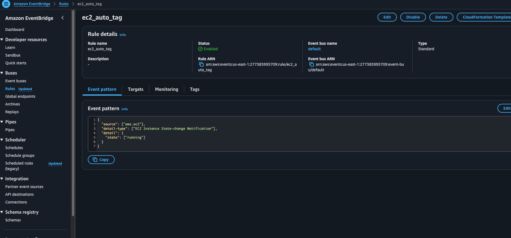
_Rule `ec2_auto_tag` saved and **Enabled**, with the event pattern confirmed matching the spec above._

### 4. Testing

1. Launch a small test instance (e.g. `t3.micro`) from the EC2 console.

   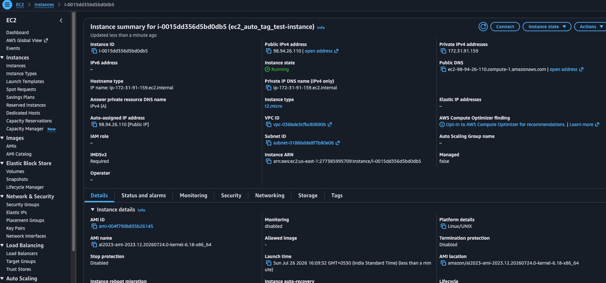
   _Instance `i-0015dd356d5bd0db5` (`ec2_auto_tag_test-instance`) launched and reaches **Running** state._

2. Wait ~30–60 seconds for it to reach the `running` state and for EventBridge to fire.

   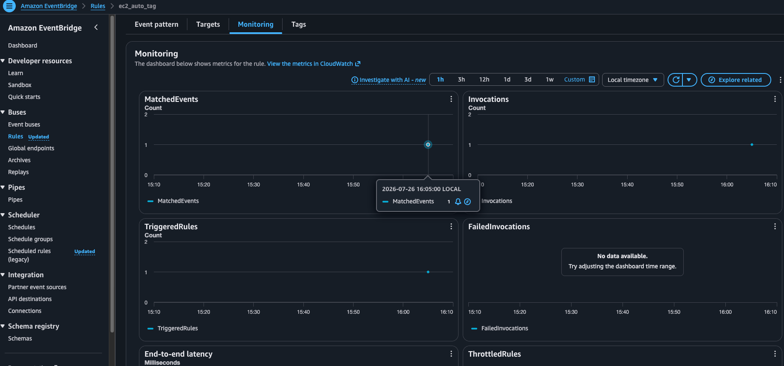
   _EventBridge rule monitoring shows **MatchedEvents = 1** and **Invocations = 1** at the moment the instance transitioned to running, confirming the rule caught the state change and invoked the Lambda._

3. In the EC2 console, select the instance → **Tags** tab → confirm `LaunchDate`, `Environment`, and `Name` appear.

   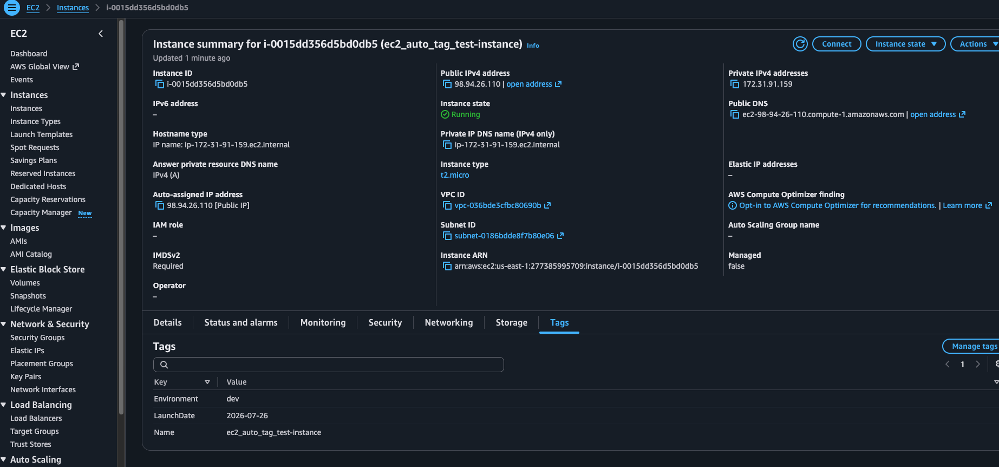
   _Tags confirmed on the instance: `Environment=dev`, `LaunchDate=2026-07-26`, `Name=ec2_auto_tag_test-instance`._

4. Check **CloudWatch Logs** for the Lambda's confirmation message.

   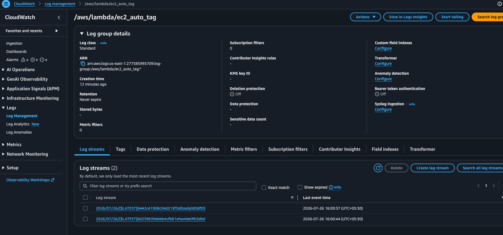
   _Log group `/aws/lambda/ec2_auto_tag` with log streams from the base-tagging invocation. Full log text captured in [`logs/cloudwatchlogs.log`](./logs/cloudwatchlogs.log), showing the Lambda tagging the instance with `LaunchDate` and `Environment` immediately on invocation._

### 5. Bonus: Owner Tag via CloudTrail

This is a common interview scenario because it demonstrates cross-service correlation:

1. Make sure **CloudTrail** is enabled in the account/region (a management-events trail, which is on by default for the last 90 days even without a dedicated trail, via **Event history**).
2. Add the `cloudtrail:LookupEvents` inline permission to the Lambda role (Step 1) — optionally, use IAM's **Generate policy** feature to derive the exact permissions the role actually used from its CloudTrail activity, as a sanity check against the hand-written policy.

   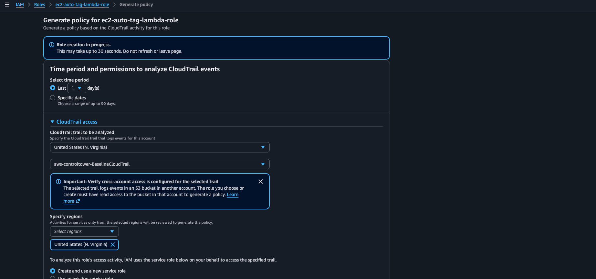
   _IAM's "Generate policy" tool analyzing the last day of CloudTrail activity for `ec2-auto-tag-lambda-role` to cross-check the actual API calls made against the inline policy granted._

3. In the Lambda, call `cloudtrail_client.lookup_events(LookupAttributes=[{"AttributeKey": "EventName", "AttributeValue": "RunInstances"}], MaxResults=20)`, parse the JSON `CloudTrailEvent` field / `Resources` list, pull the `Username`, and add it as the `Owner` tag.
4. Enable the bonus path via environment variables:

   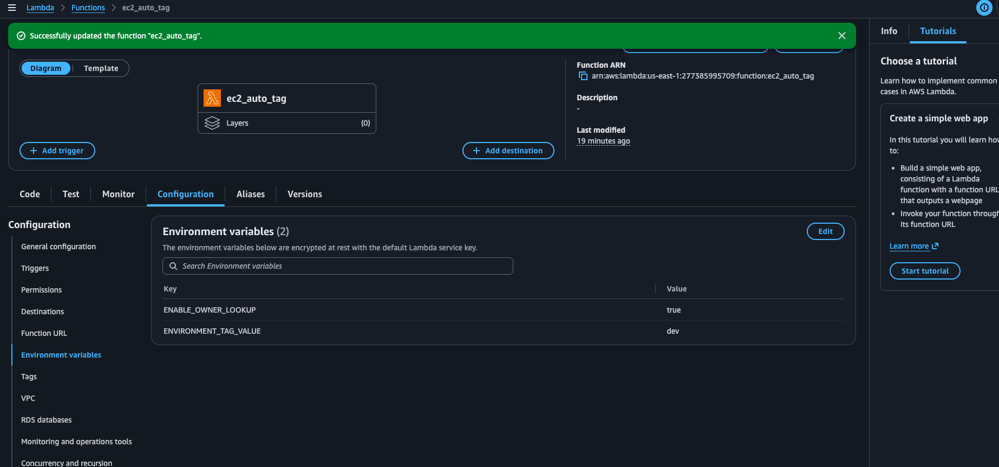
   _`ENABLE_OWNER_LOOKUP=true` and `ENVIRONMENT_TAG_VALUE=dev` set on the Lambda to activate the CloudTrail lookup path._

5. **Observation while testing:** CloudTrail hasn't always indexed the `RunInstances` event by the time the Lambda runs (eventual consistency — indexing lag of anywhere from a few seconds to a few minutes is normal). Rather than failing the whole function, the code falls back to `Owner=unknown` if the lookup comes back empty.
6. To reduce (not eliminate) this lag's impact, a configurable delay was introduced via `CLOUDTRAIL_LOOKUP_DELAY_SECONDS`, which pauses before querying CloudTrail. For this testing round it was set to `60` seconds.

   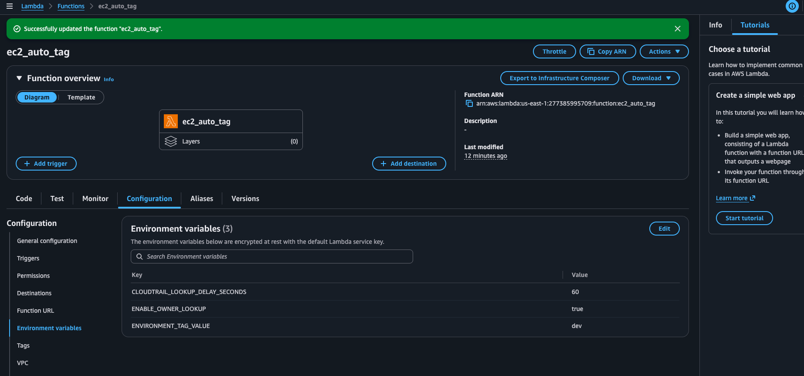
   _Environment variables updated to `CLOUDTRAIL_LOOKUP_DELAY_SECONDS=60`, `ENABLE_OWNER_LOOKUP=true`, `ENVIRONMENT_TAG_VALUE=dev`. (Lambda timeout was also raised well above 60s to accommodate the delay.)_

### 6. Testing of Bonus Point

1. Launch a fresh test instance with the bonus path enabled.

   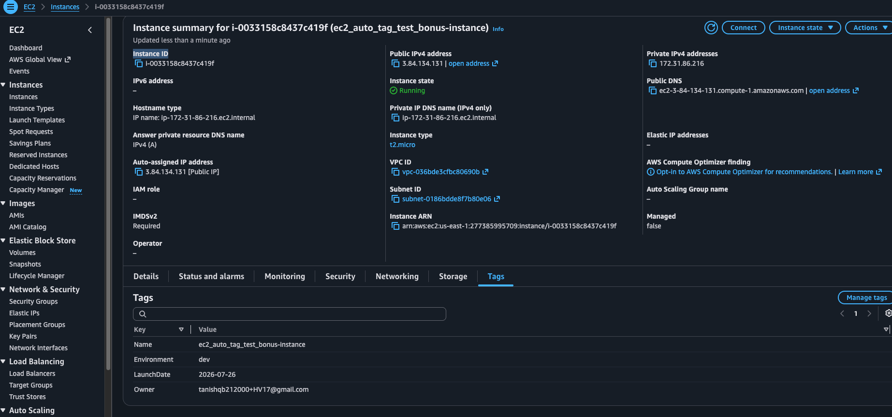
   _Instance `i-0033158c8437c419f` (`ec2_auto_tag_test_bonus-instance`) shows all four tags applied: `Name`, `Environment`, `LaunchDate`, and `Owner=tanishqb212000+HV17@gmail.com` — successfully resolved via the CloudTrail lookup._

2. Confirm in CloudWatch Logs that the lookup found and matched the launch event, and that the `Owner` tag was applied in the second (delayed) `create_tags` call.

   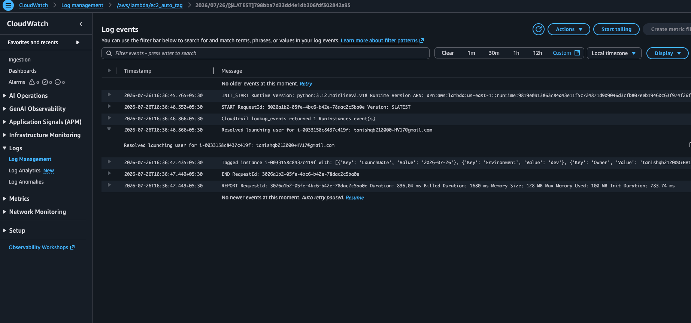
   _Logs show `CloudTrail lookup_events returned 1 RunInstances event(s)`, followed by `Resolved launching user for i-0033158c8437c419f: tanishqb212000+HV17@gmail.com`, and the final tagged-instance confirmation including the `Owner` tag. Full log text in [`logs/cloudwatchlogs-bonus.log`](./logs/cloudwatchlogs-bonus.log)._

3. This confirms the two-phase tagging approach works as designed: base tags (`LaunchDate`, `Environment`, `Name`) land immediately on invocation, and `Owner` lands separately once the CloudTrail lookup (after its configured delay) successfully resolves the launching identity.

## Discussion Point

Auto-tagging via Lambda + EventBridge is the standard pattern because EC2 launch tags alone (via the `RunInstances` API's own `TagSpecifications`) only capture what the **caller** explicitly set at launch time — they can't retroactively enrich instances with computed values like `LaunchDate` or values looked up from another service like the IAM caller identity. This event-driven pattern (react to a state-change event, then call back into the API to enrich) is broadly reusable for cost allocation, ownership tracking, and compliance tagging across other resource types (EBS volumes, RDS instances, etc.).

A secondary lesson from testing the bonus path: CloudTrail's eventual consistency means a purely synchronous "wait N seconds, then look up" approach inside a single Lambda invocation is a workable demo/interview answer, but not a production-grade one — it burns Lambda compute time idling and still isn't guaranteed to beat CloudTrail's indexing lag in all cases. A more robust production design would decouple the two concerns: tag `LaunchDate`/`Environment`/`Name` synchronously on the EventBridge trigger, then use a separate scheduled Lambda (or retry-with-backoff pattern) to backfill the `Owner` tag once CloudTrail has actually caught up.
