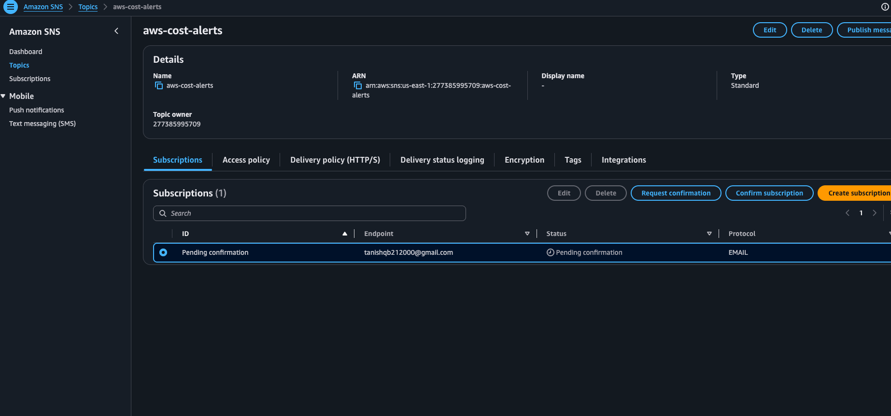
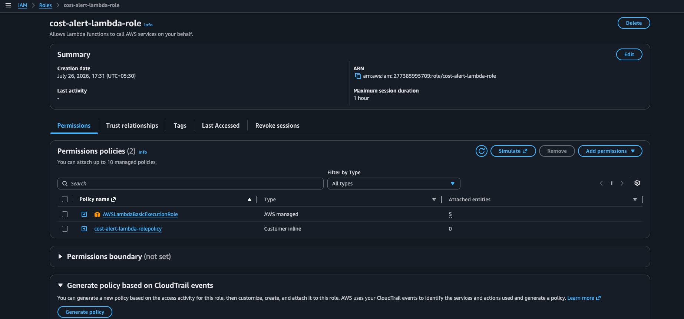
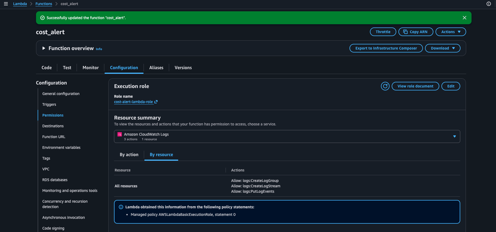
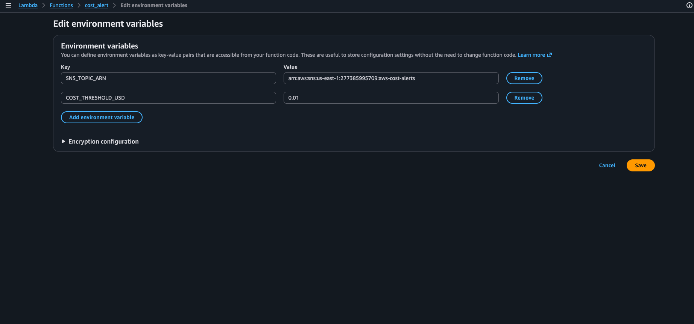
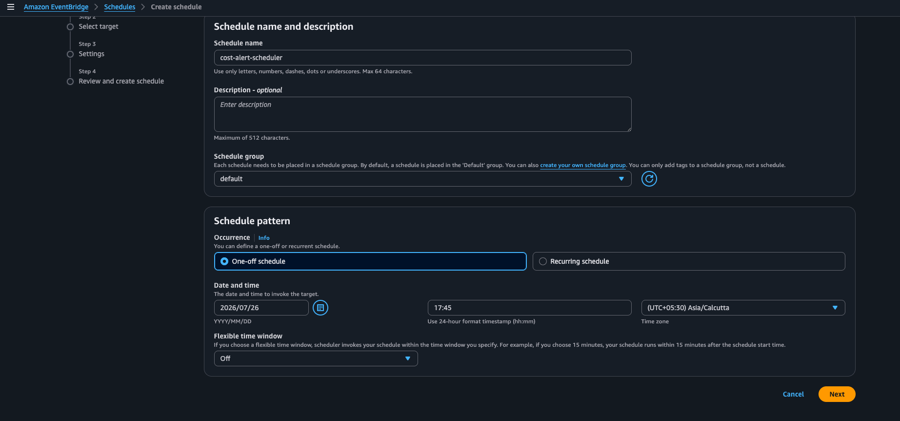
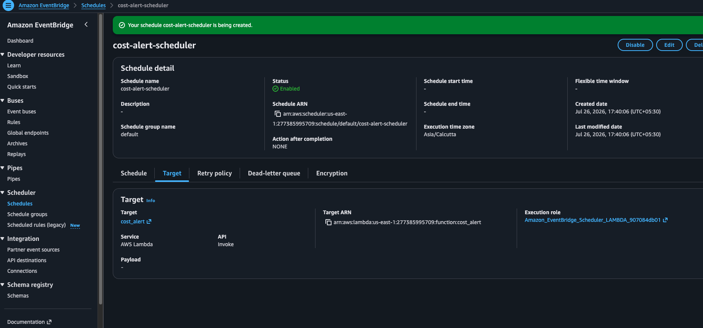
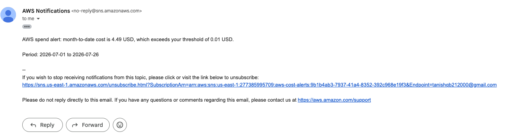
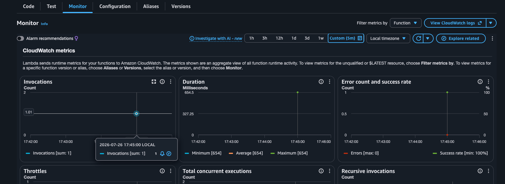

# 4. Daily AWS Cost Alert Using Cost Explorer API and SNS

**Objective:** Build an automated alert when AWS spend exceeds a threshold, using the **Cost Explorer API** (`ce:GetCostAndUsage`) rather than the legacy CloudWatch Billing metric.

> Note: the CloudWatch "Billing" alarm metric only exists in `us-east-1` and requires manually enabling "Receive Billing Alerts" — it's legacy. The Cost Explorer API is the modern, interview-relevant approach and works from any region (the Lambda calls a global endpoint).

## Architecture

```
EventBridge (daily) --> Lambda (Python 3.12, Boto3) --> Cost Explorer (ce:GetCostAndUsage)
                                                                 |
                                                     threshold exceeded?
                                                                 |
                                                                 v
                                                          SNS (sns:Publish) --> Email subscriber
```

## Steps to Achieve

### 1. SNS Setup

1. **SNS console → Topics → Create topic** → Type: **Standard** → Name: `aws-cost-alerts`.
2. **Create subscription** → Protocol: **Email** → Endpoint: your email address.
3. Check your inbox and click **Confirm subscription** — SNS won't deliver to unconfirmed subscriptions.
4. Note the **Topic ARN**: `arn:aws:sns:us-east-1:277385995709:aws-cost-alerts`


_Topic `aws-cost-alerts` created, with an email subscription to `tanishqb212000@gmail.com` in **Pending confirmation** status until the confirmation link is clicked._

### 2. Lambda IAM Role

Create a role (`cost-alert-lambda-role`) with `AWSLambdaBasicExecutionRole` attached, plus this inline policy (see [`inline-policy.json`](./inline-policy.json)):

```json
{
  "Version": "2012-10-17",
  "Statement": [
    {
      "Sid": "ReadCostExplorer",
      "Effect": "Allow",
      "Action": "ce:GetCostAndUsage",
      "Resource": "*"
    },
    {
      "Sid": "PublishToCostAlertsTopic",
      "Effect": "Allow",
      "Action": "sns:Publish",
      "Resource": "arn:aws:sns:us-east-1:277385995709:aws-cost-alerts"
    }
  ]
}
```

(`ce:GetCostAndUsage` doesn't support resource-level scoping — Cost Explorer is account-wide by design — so it's `Resource: *`; the SNS publish permission is what's scoped down to your specific topic.)


_`cost-alert-lambda-role` with `AWSLambdaBasicExecutionRole` (AWS managed) and `cost-alert-lambda-rolepolicy` (customer inline) attached. The **Generate policy based on CloudTrail events** panel is also available here as a cross-check tool if you want to verify the role's actual usage matches the granted permissions._

### 3. Lambda Function

1. Create a Lambda function: runtime **Python 3.12**, attach the role above.
2. Environment variables:
   - `SNS_TOPIC_ARN` = your topic ARN from step 1
   - `COST_THRESHOLD_USD` = `50` (or `0.01` for forced testing)
3. Paste the code from [`lambda/cost_alert.py`](lambda/cost_alert.py). It:
   1. Initializes `ce = boto3.client("ce")` (must be called from `us-east-1` or with the endpoint that supports Cost Explorer — the client works from any Lambda region since Cost Explorer's API is a global service reachable from `ce.us-east-1.amazonaws.com`) and `sns = boto3.client("sns")`.
   2. Queries **month-to-date** `UnblendedCost` with `get_cost_and_usage(TimePeriod={"Start": <1st of month>, "End": <today>}, Granularity="MONTHLY", Metrics=["UnblendedCost"])`.
   3. Parses the returned amount and compares it against `COST_THRESHOLD_USD`.
   4. If exceeded, calls `sns.publish(TopicArn=..., Subject=..., Message=...)` with the current month-to-date spend.
   5. Prints the retrieved amount either way, for CloudWatch Logs auditing.


_Lambda function `cost_alert` configured with `cost-alert-lambda-role` as its execution role. The permissions resource summary confirms the role's CloudWatch Logs access (from `AWSLambdaBasicExecutionRole`) alongside the custom Cost Explorer / SNS permissions._


_`SNS_TOPIC_ARN` and `COST_THRESHOLD_USD` set on the Lambda. Shown here already lowered to `0.01` for forced testing — see Step 5._

### 4. EventBridge Schedule (Daily)

1. **EventBridge → Schedules → Create schedule**.
2. Schedule name: `cost-alert-scheduler`.
3. Schedule pattern: for the real daily automation use a **Recurring schedule** with `cron(0 8 * * ? *)` (daily at 08:00 UTC). For a controlled single test run, a **One-off schedule** at a specific date/time works too.
4. Target: this Lambda function (`cost_alert`).
5. Save.


_Schedule `cost-alert-scheduler` being created with a **One-off schedule** occurrence at `2026/07/26 17:45 (UTC+05:30)`, used here for a controlled test invocation. Switch to **Recurring schedule** with the daily cron expression for the production version._


_Schedule `cost-alert-scheduler` saved and **Enabled**, targeting Lambda `cost_alert` via the `Amazon_EventBridge_Scheduler_LAMBDA_907084db01` execution role._

### 5. Testing

1. Temporarily set `COST_THRESHOLD_USD` to something you're certain to exceed, e.g. `0.01` (see Screenshot in Step 3 above).
2. Manually invoke the Lambda with an empty test event `{}`, or let the scheduled trigger fire.
3. Check your email for the SNS alert.

   
   _Email from AWS Notifications confirming: "AWS spend alert: month-to-date cost is 4.49 USD, which exceeds your threshold of 0.01 USD" for the period `2026-07-01` to `2026-07-26`._

4. Check the Lambda's **Monitor** tab and CloudWatch Logs for the printed spend amount.

   
   _Invocations = 1, zero errors, 100% success rate, ~654ms duration — confirming a clean successful run._

   Full log text in [`logs/cloudwatchlog.log`](./logs/cloudwatchlog.log), showing two separate invocations both logging:

   ```
   Month-to-date spend (2026-07-01 to 2026-07-26): 4.49 USD
   Threshold exceeded - SNS alert published.
   ```

5. Reset `COST_THRESHOLD_USD` back to your real target (e.g. `50`) once confirmed working.

## Discussion Point: Lambda vs. AWS Budgets

**AWS Budgets** is the fully managed alternative — you can set a cost/usage budget with a threshold and email/SNS notification with no code at all. A custom Lambda approach is still worth it when you need **per-service or per-tag cost breakdowns** in the alert body (Budgets' notification text is fixed-format), **delivery to Slack/Microsoft Teams** via a webhook instead of just email/SNS, or **custom anomaly logic** (e.g. "alert only if today's spend is 2x yesterday's" rather than a flat threshold) that Budgets' static threshold model doesn't support.
